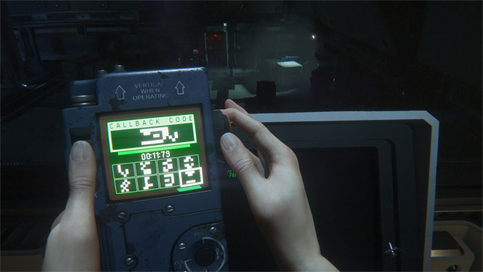

# React Flux Puzzle

An experiment built with React + Rx + Immutable.js and the awesome Flux structure 🍃

> You can play it and check it out here: [weslleyaraujo.github.io/react-flux-puzzle](http://weslleyaraujo.github.io/react-flux-puzzle)

## The reason

I started this project with the intuit to apply some technologies that I have been studying in the last few months..
this is the real first app that I wrote using stuff such as [Rx.js](http://reactivex.io/), [React](https://facebook.github.io/react/) and [Immutable.js](https://facebook.github.io/immutable-js/),
so please, I would love to get some feedback to improve my code 😀

I was inspired by the great game [Alien Isolation](http://www.alienisolation.com/) which you can play a very similar puzzle:



### Installing

It depends on npm and some awesome packages.
To install it just run the following commands:

```
npm install
```

### Starting

You can run locally using:

```
npm start
```

It will generate the necessary assets and run up a server into `http://localhost:3000`

### Building

You can build it using the `build` task, just run:

```
npm run build
```

### Deploy

The deploy task runs the build and upload the `dist` dir into the `gh-pages`

```
npm run deploy
```

#### Contributing

Changes and improvements are more than welcome! Feel free to fork and open a pull request. Please make your changes in a specific branch and request to pull into master! If you can, please make sure the game fully works before sending the PR, as that will help speed up the process.
I'm following [this](https://github.com/netshoes/styleguide/tree/master/scm) styleguide to name branches and pull requests, make sure you follow this too 😁

#### License

This application is licensed under the [Beerware License](https://en.wikipedia.org/wiki/Beerware).
